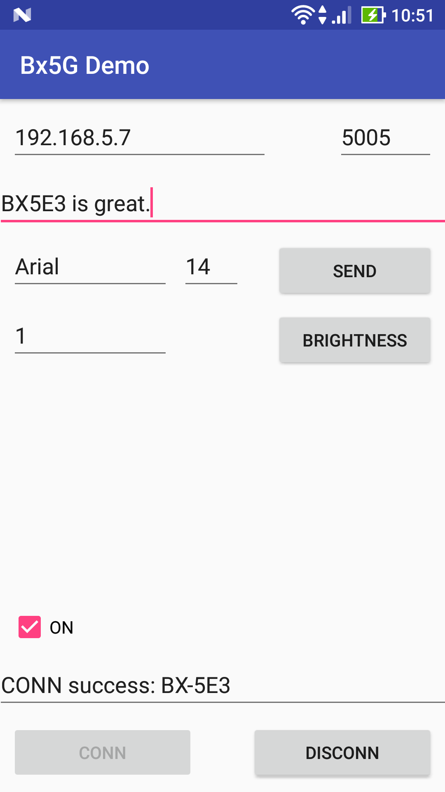

onbon bx05 api for Android
=====================
[](https://travis-ci.org/api2doc/onbon.bx05.mobiledemo)
[](https://www.codacy.com/app/api2doc/onbon-bx05-mobiledemo?utm_source=github.com&amp;utm_medium=referral&amp;utm_content=api2doc/onbon.bx05.mobiledemo&amp;utm_campaign=Badge_Grade)

[English](README_en.md)

本文件說明如何在 [Android Studio](https://developer.android.com/studio/index.html) 開發環境下，建立 [onbon.bx05 api](https://github.com/api2doc/onbon.bx05.api) 的開發項目。

github source 測試對象為 BX-5E3 雙色控制器，資料顯示位置固定在 (448, 0)，內容大小 為 (64, 32)。



## 相依檔案

#### JAR - [onbon bx05 api](https://github.com/api2doc/onbon.bx05.api) Java 庫 (7/10)
* bx05.message-x.x.x-SNAPSHOT.jar

* bx05-x.x.x-SNAPSHOT.jar

* log4j-1.2.14.jar

* simple-xml-2.7.1.jar

* uia.comm-x.x.x.jar

* uia.message-x.x.x.jar

* uia.utils-x.x.x.jar

#### AAR - onbon bx05 api on Android devcie 庫 (Android 專用)
* java.awt4a-0.1-release.aar

## Project 相關設定

#### build.gradle

* flatDir - 設定相依 libs 的儲存位置。

``` gradle
allprojects {
    repositories {
        jcenter()
        flatDir {
            dirs 'libs'
        }
    }
}
```

## App 相關設定

#### build.gradle

* project.ext.set - 設定輸出檔案名稱。

* dexOptions - 允許掛載 Java AWT for Android。

* dependencies - 定義 onbon.bx05 API 相關的 JAR & AAR 等八個檔案。檔案儲存在 __libs__ 資料夾下。注意：檔名依使用版本調正。


``` gradle
android {
    ...
    defaultConfig {
        ...
        project.ext.set("archivesBaseName", "bx5g.mobiledemo-" + defaultConfig.versionName);
    }
    dexOptions {
        preDexLibraries = false
        additionalParameters =["--core-library"]
    }

}

dependencies {
    ...
    compile files('libs/bx05.message-0.5.0-SNAPSHOT.jar')
    compile files('libs/bx05-0.5.0-SNAPSHOT.jar')
    compile files('libs/log4j-1.2.14.jar')
    compile files('libs/simple-xml-2.7.1.jar')
    compile files('libs/uia.comm-0.2.1.jar')
    compile files('libs/uia.message-0.5.1.jar')
    compile files('libs/uia.utils-0.1.2.jar')
    compile(name:'java.awt4a-0.1-release', ext:'aar')
    ...
}

```

#### AndroidManifest.xml

* android:name - 設定啟動應用程式類別，用來建立 BX5G API 運行環境。

* android.permission.INTERNET - 設定允許 Socket 操作。

``` XML
<application
    android:name="onbon.bx05.mobiledemo.MainApplication"
    ...>
</application>
<uses-permission android:name="android.permission.INTERNET" />
```


#### MainApplication.java

AndroidManifest.xml 中 __android:name__ 設定類別的實作。

``` Java
package onbon.bx05.mobiledemo;

import android.app.Application;

import j2a.awt.AwtEnv;
import onbon.bx05.Bx5GEnv;

public class MainApplication extends Application {

    private boolean initial;

    @Override
    public void onCreate() {
        super.onCreate();

        try {
            // java.awt for android 初始化
            AwtEnv.link(this);                          // 將 Application 與 AWT 連結
            AwtEnv.configPaintAntiAliasFlag(true);      // 設定圖案是要抗鋸齒。

            // 建立 BX5G API 運行環境。
            Bx5GEnv.initial();

            this.initial = true;
        }
        catch (Exception ex) {
            this.initial = false;
        }
    }
}
```

#### MainApplication.java
[程式碼](app/src/main/java/onbon/bx05/mobiledemo/MainActivity.java)

## 開發注意事項

#### Screen (控制器) 操作
因為 Socket Client 不得執行於 UI 線程上，所以對 Screen 的操作都須在新的線程上，方能正確工作。
``` Java
new Thread(new Runnable() {
    public void run() {
        // 操作 Screen
    }
}).start();
```

#### UI 更新
在非 UI 線程上操作 Screen 後，欲將結果回報至 UI 時，利用 __runOnUiThread__ 方法。
``` Java
runOnUiThread(new Runnable() {
    public void run() {
        // 更新 UI
    }
});
```
