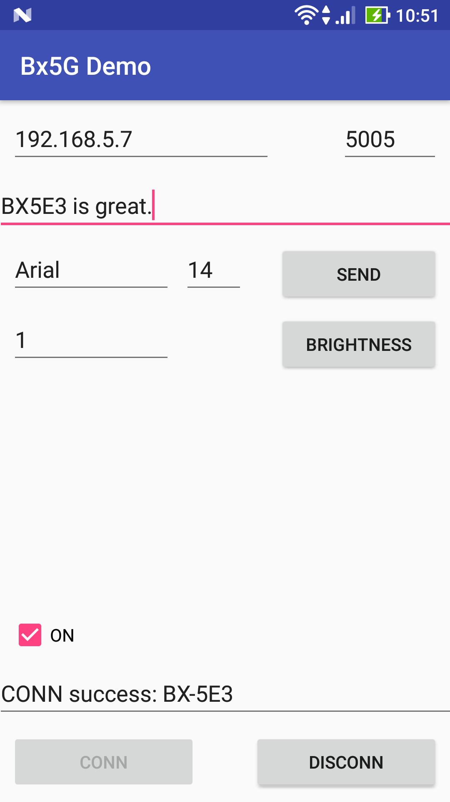

onbon bx05 api for Android
=====================
[](https://travis-ci.org/api2doc/onbon.bx05.mobiledemo)
[](https://www.codacy.com/app/api2doc/onbon-bx05-mobiledemo?utm_source=github.com&amp;utm_medium=referral&amp;utm_content=api2doc/onbon.bx05.mobiledemo&amp;utm_campaign=Badge_Grade)

[Chinese](README.md)

This document describes how to create a project of [onbon.bx05 api](https://github.com/api2doc/onbon.bx05.api) in [Android Studio](https://developer.android.com/studio/index.html) IDE.

The controller that template from github source tests is BX-5E3. Test information always be showed at fixed position (448, 0) with fixed size (64,32).



## dependency files

#### JAR - onbon bx05 api Java Libraries (same as Desktop version)
* bx05.message-0.5.0-SNAPSHOT.jar

* bx05-0.5.0-SNAPSHOT.jar

* log4j-1.2.14.jar

* simple-xml-2.7.1.jar

* uia.comm-0.2.1.jar

* uia.message-0.5.1.jar

* uia.utils-0.1.2.jar

#### AAR - onbon bx05 api on Android devcie Libraries (Android only)
* java.awt4a-0.1-release.aar

## project configuration

#### build.gradle

* flatDir - setup where library files saved.

``` gradle
allprojects {
    repositories {
        jcenter()
        flatDir {
            dirs 'libs'
        }
    }
}
```

## app configuration

#### build.gradle

* project.ext.set - output name.

* dexOptions - allow to load Java AWT for Android。

* dependencies - define dependency files of onbon.bx05 API including JAR and AAR. All files saved in __libs__ folder.


``` gradle
android {
    ...
    defaultConfig {
        ...
        project.ext.set("archivesBaseName", "bx5g.mobiledemo-" + defaultConfig.versionName);
    }
    dexOptions {
        preDexLibraries = false
        additionalParameters =["--core-library"]
    }

}

dependencies {
    ...
    compile files('libs/bx05.message-0.5.0-SNAPSHOT.jar')
    compile files('libs/bx05-0.5.0-SNAPSHOT.jar')
    compile files('libs/log4j-1.2.14.jar')
    compile files('libs/simple-xml-2.7.1.jar')
    compile files('libs/uia.comm-0.2.1.jar')
    compile files('libs/uia.message-0.5.1.jar')
    compile files('libs/uia.utils-0.1.2.jar')
    compile(name:'java.awt4a-0.1-release', ext:'aar')
    ...
}

```

#### AndroidManifest.xml

* android:name - setup startup class to initial runtime environment of BX5G API.

* android.permission.INTERNET - allow to use socket.

``` XML
<application
    android:name="onbon.bx05.mobiledemo.MainApplication"
    ...>
</application>
<uses-permission android:name="android.permission.INTERNET" />
```


#### MainApplication.java

Implementation of class which defines at __android:name__ in AndroidManifest.xml.

``` Java
package onbon.bx05.mobiledemo;

import android.app.Application;

import j2a.awt.AwtEnv;
import onbon.bx05.Bx5GEnv;

public class MainApplication extends Application {

    private boolean initial;

    @Override
    public void onCreate() {
        super.onCreate();

        try {
            // java.awt for android initial
            AwtEnv.link(this);                          // link application and AWT
            AwtEnv.configPaintAntiAliasFlag(true);      // setup anti-alias flag.

            // BX5G API initial
            Bx5GEnv.initial();

            this.initial = true;
        }
        catch (Exception ex) {
            this.initial = false;
        }
    }
}
```
#### MainApplication.java
[Source Code](app/src/main/java/onbon/bx05/mobiledemo/MainActivity.java)

## Develop

#### Screen (Controller) operation
Because socket client can't be runned on UI thread, all operations execute to screen need to run in new thread.
``` Java
new Thread(new Runnable() {
    public void run() {
        // operate to screen
    }
}).start();
```

#### UI Update
After executing to screen on non UI thread, use __runOnUiThread__ to callback to UI thread.
``` Java
runOnUiThread(new Runnable() {
    public void run() {
        // update UI
    }
});
```
